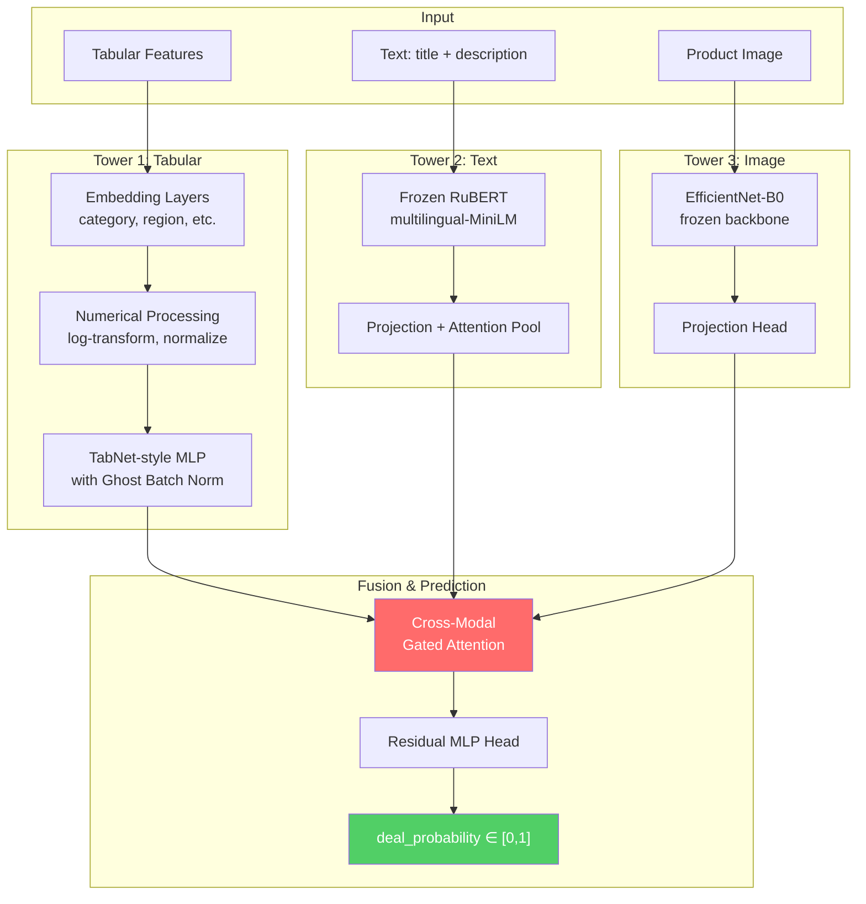
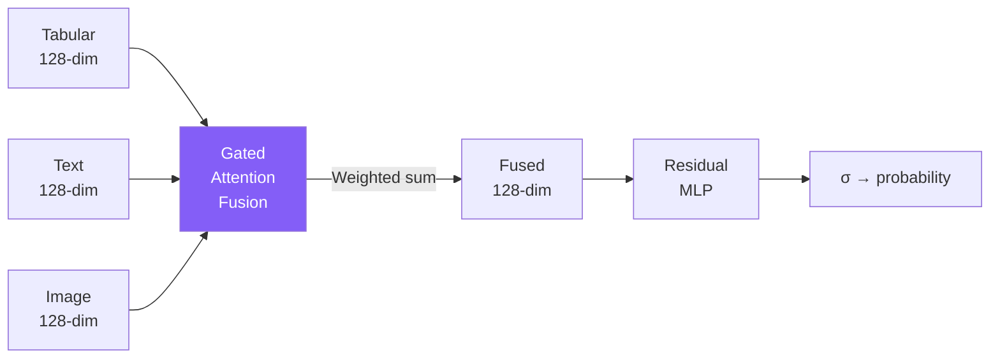

# 🏗️ Avito Demand Prediction — Architectural Vision

## Part 1: Multi-Modal Deep Learning Architecture

### Overview

The solution employs a **three-tower architecture with cross-modal attention fusion**, designed to handle the three distinct data modalities (tabular, text, image) while respecting the hardware constraints (GTX 1650 / 4GB VRAM, 16GB RAM).



---

### 1. Tabular Tower — Structured Feature Processing

**Strategy**: Entity embeddings + engineered features + residual MLP

| Feature | Approach |
|---|---|
| `region`, `city`, `parent_category_name`, `category_name`, `param_1/2/3`, `user_type` | Learned embeddings (dim = min(50, cardinality//2)) |
| `price` | Log1p transform → standardize |
| `item_seq_number` | Log1p transform → standardize |
| `image_top_1` | Treated as categorical embedding |
| `activation_date` | Extracted: day-of-week, day-of-month, week-of-year |

**Why this approach?**
- Entity embeddings capture categorical semantics far better than one-hot encoding, especially for high-cardinality features like `city` (~1,700 unique values)
- The residual MLP with Ghost Batch Normalization (from TabNet) provides regularization superior to standard dropout for tabular data
- Log transforms for price/seq_number handle the heavy-tailed distributions common in marketplace data

---

### 2. Text Tower — Russian NLP Processing

**Strategy**: Frozen multilingual sentence transformer → learned projection

**Model Choice**: `sentence-transformers/paraphrase-multilingual-MiniLM-L12-v2`

> [!IMPORTANT]
> We use a **frozen** pre-trained multilingual model to extract 384-dim embeddings. This is critical because:
> - Fine-tuning a transformer on 4GB VRAM with this dataset size is impractical
> - The multilingual MiniLM already handles Russian text natively
> - Pre-computing embeddings offline enables massive training speedup

**Pipeline**:
1. **Offline**: Pre-compute sentence embeddings for `title` and `description` separately (saved to disk as `.npy` memory-mapped arrays)
2. **Online**: Load pre-computed embeddings → learned linear projection → attention-weighted combination of title + description embeddings

**Why not translate to English?**
- Translation adds noise and loses Russian-specific semantics (e.g., regional slang)  
- Multilingual models handle Russian directly with high quality
- Avoids the latency and cost of translation APIs for 1.5M+ texts

---

### 3. Image Tower — Visual Feature Extraction

**Strategy**: Frozen EfficientNet-B0 → learned projection head

**Pipeline**:
1. **Offline**: Pre-extract image features from EfficientNet-B0's penultimate layer (1280-dim) and save to disk
2. **Online**: Load pre-computed features → MLP projection (1280 → 256 → 128)

**Why EfficientNet-B0?**
- Extremely efficient: only 5.3M params, fits easily in VRAM
- Pre-trained on ImageNet provides rich visual features transferable to product photos
- The B0 variant is the best accuracy/efficiency trade-off for our hardware

**Missing Image Handling**: ~30% of listings lack images. We use a **learned "no-image" embedding** vector that the model learns to interpret as "image absent", avoiding the information loss of zero-filling.

---

### 4. Fusion Strategy — Cross-Modal Gated Attention



**Mechanism**:
Each modality tower outputs a 128-dim vector. The fusion module computes:

1. **Gating weights**: `g = softmax(W_g · [h_tab; h_text; h_img])` — learned attention over modalities
2. **Fused representation**: `h_fused = g_1·h_tab + g_2·h_text + g_3·h_img`
3. **Residual connection**: `h_out = h_fused + MLP(h_fused)`

**Why gated attention over simple concatenation?**
- Different ads benefit differently from each modality (e.g., text matters more for services, images matter more for physical goods)
- Gating allows the model to dynamically weight modalities per-sample
- Concatenation + MLP treats all modalities equally and requires more parameters

---

### 5. Training Strategy

| Component | Choice |
|---|---|
| **Loss** | MSE (directly optimizes RMSE) |
| **Optimizer** | AdamW (weight decay = 1e-2) |
| **Scheduler** | OneCycleLR (max_lr=3e-3) |
| **Batch Size** | 256 (fits in 4GB VRAM with pre-computed features) |
| **Epochs** | 10 with early stopping (patience=3) |
| **Validation** | 10% hold-out stratified by `deal_probability` bins |
| **Mixed Precision** | FP16 via `torch.amp` for 2x memory savings |

---

### 6. Memory-Efficient Design

> [!TIP]
> The key insight is to **decouple feature extraction from model training**:
> - Text/image features are pre-computed once and saved as memory-mapped NumPy arrays
> - During training, only the lightweight fusion model (~2M params) runs on GPU
> - DataLoader uses memory-mapped files — only accessed rows are loaded into RAM

This design enables training on a 4GB GPU with a 1.5M row dataset, which would otherwise require 24+ GB VRAM for end-to-end fine-tuning.

---

### 7. File Structure

```
BTL/
├── input/                        # Raw data (existing)
├── src/
│   ├── config.py                 # All hyperparameters & paths
│   ├── preprocess.py             # Offline feature extraction pipeline
│   ├── dataset.py                # PyTorch Dataset with mmap loading
│   ├── model.py                  # Three-tower model definition
│   ├── train.py                  # Training loop with validation
│   └── predict.py                # Generate submission
├── features/                     # Pre-computed features (generated)
├── checkpoints/                  # Model checkpoints (generated)
└── requirements.txt
```
