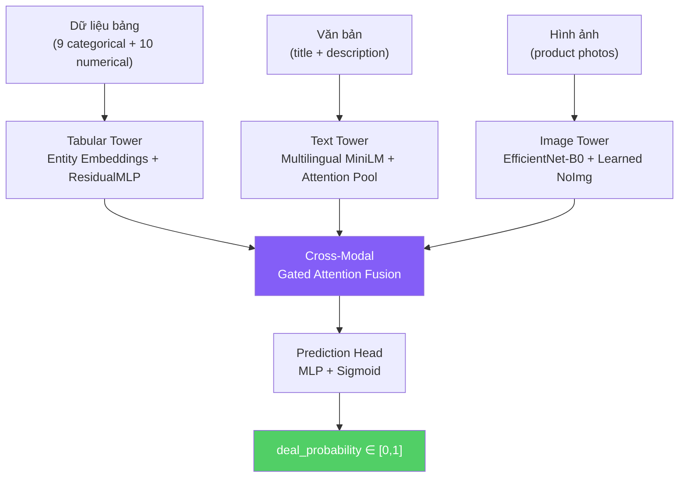
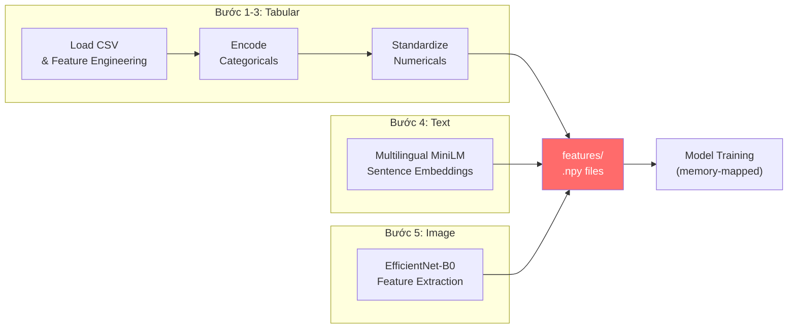

# 📋 BÁO CÁO CHI TIẾT: DỰ ĐOÁN NHU CẦU QUẢNG CÁO AVITO
# Giải pháp Deep Learning Đa phương thức (Multi-Modal)

---

## Mục lục
- [1. Tổng quan đề tài](#1-tổng-quan-đề-tài)
- [2. Phân tích dữ liệu thăm dò (EDA)](#2-phân-tích-dữ-liệu-thăm-dò-eda)
- [3. Tiền xử lý dữ liệu](#3-tiền-xử-lý-dữ-liệu)
- Phần 2: Kiến trúc mô hình, Thực nghiệm, Triển khai, Kết luận → [report_p2.md](file://report_p2.md)

---

## 1. Tổng quan đề tài

### 1.1. Bối cảnh

**Avito** là nền tảng rao vặt trực tuyến lớn nhất nước Nga, nơi hàng triệu người dùng đăng tin bán hàng mỗi ngày. Cuộc thi **"Avito Demand Prediction Challenge"** trên Kaggle đặt ra bài toán: **dự đoán xác suất giao dịch thành công** (`deal_probability`) cho mỗi tin đăng, dựa trên thông tin đa dạng bao gồm dữ liệu bảng (tabular), văn bản (text), và hình ảnh (image).

### 1.2. Phát biểu bài toán

| Thành phần | Chi tiết |
|---|---|
| **Đầu vào** | Tin đăng gồm: thông tin phân loại, giá cả, tiêu đề, mô tả (tiếng Nga), ảnh sản phẩm |
| **Đầu ra** | `deal_probability` ∈ [0, 1] — xác suất giao dịch thành công |
| **Bài toán** | Hồi quy (Regression) |
| **Metric đánh giá** | RMSE (Root Mean Squared Error) |
| **Thách thức chính** | Dữ liệu đa phương thức, văn bản tiếng Nga, thiếu ảnh ~7.5%, phân phối target lệch mạnh |

### 1.3. Tổng quan giải pháp

Chúng tôi thiết kế kiến trúc **Three-Tower với Cross-Modal Gated Attention Fusion** sử dụng PyTorch:



### 1.4. Môi trường phần cứng

| Thành phần | Thông số |
|---|---|
| GPU | NVIDIA GeForce GTX 1650 (4 GB VRAM) |
| RAM | 16 GB |
| CPU | 16 cores |
| Framework | PyTorch 2.12 + CUDA 13.0 |
| Python | 3.10.12 |

> [!IMPORTANT]
> Với giới hạn 4 GB VRAM, giải pháp được thiết kế theo chiến lược **"decouple feature extraction"**: trích xuất đặc trưng text/image offline, chỉ huấn luyện mô hình fusion nhẹ (~1M tham số) trên GPU.

---

## 2. Phân tích dữ liệu thăm dò (EDA)

### 2.1. Tổng quan tập dữ liệu

| Tập dữ liệu | Số mẫu | Số cột | Kích thước file |
|---|---|---|---|
| **Train** | 1,503,424 | 18 (bao gồm target) | 953 MB |
| **Test** | 508,438 | 17 | 331 MB |
| **Train images** | ~1,390,836 ảnh | — | 53 GB (zip) |
| **Test images** | — | — | 20 GB (zip) |

### 2.2. Mô tả các cột dữ liệu

| Cột | Kiểu | Mô tả |
|---|---|---|
| `item_id` | String | Mã định danh duy nhất cho mỗi tin đăng |
| `user_id` | String | Mã định danh người đăng |
| `region` | Categorical | Vùng địa lý (28 vùng) |
| `city` | Categorical | Thành phố (1,733 thành phố) |
| `parent_category_name` | Categorical | Danh mục cha (9 loại) |
| `category_name` | Categorical | Danh mục con (47 loại) |
| `param_1`, `param_2`, `param_3` | Categorical | Tham số đặc thù theo danh mục |
| `title` | Text | Tiêu đề tin đăng (tiếng Nga) |
| `description` | Text | Mô tả chi tiết (tiếng Nga) |
| `price` | Numerical | Giá niêm yết |
| `item_seq_number` | Numerical | Thứ tự đăng tin của user |
| `activation_date` | Date | Ngày đăng tin (15/03 – 07/04/2017) |
| `user_type` | Categorical | Loại người dùng: Private / Company / Shop |
| `image` | String | ID ảnh sản phẩm (SHA hash) |
| `image_top_1` | Numerical | Mã phân loại ảnh từ Avito |
| `deal_probability` | Float | **Biến mục tiêu** ∈ [0, 1] |

### 2.3. Phân phối biến mục tiêu

```
deal_probability:
  Count:    1,503,424
  Mean:     0.1391
  Std:      0.2601
  Min:      0.0000
  Median:   0.0000  ← Hơn 50% giá trị = 0
  75%:      0.1509
  Max:      1.0000

  Tỷ lệ = 0:  64.83%
  Tỷ lệ = 1:   0.67%
```

> [!WARNING]
> Phân phối **lệch rất mạnh (highly skewed)**: gần 65% tin đăng có xác suất giao dịch = 0. Đây là thách thức lớn cho mô hình hồi quy — cần thiết kế kiến trúc có khả năng phân biệt giữa các giá trị gần 0 và các giá trị cao hơn.

### 2.4. Dữ liệu thiếu (Missing Values)

| Cột | % thiếu | Ghi chú |
|---|---|---|
| `param_3` | 57.37% | Hơn nửa tin đăng không có tham số thứ 3 |
| `param_2` | 43.54% | Gần nửa thiếu tham số thứ 2 |
| `description` | 7.73% | Một số tin không có mô tả |
| `image` / `image_top_1` | 7.49% | Không phải tin nào cũng có ảnh |
| `price` | 5.68% | Một số tin không đăng giá |
| `param_1` | 4.10% | Ít bị thiếu hơn |

### 2.5. Đặc trưng phân loại (Categorical)

| Feature | Số giá trị | Đặc điểm |
|---|---|---|
| `region` | 28 | Cardinality thấp |
| `city` | 1,733 | **Cardinality cao** — cần entity embedding |
| `parent_category_name` | 9 | Cardinality thấp |
| `category_name` | 47 | Cardinality trung bình |
| `param_1` | 371 | Cardinality trung bình |
| `param_2` | 271 | Cardinality trung bình |
| `param_3` | 1,219 | **Cardinality cao** |
| `user_type` | 3 | Private (71.6%), Company (23.1%), Shop (5.4%) |
| `image_top_1` | 3,062 | **Cardinality rất cao** |

### 2.6. Đặc trưng số (Numerical)

| Feature | Mean | Median | Max | Đặc điểm |
|---|---|---|---|---|
| `price` | 316,708 | 1,300 | 79.5 tỷ | **Extremely skewed** — cần log transform |
| `item_seq_number` | 743.7 | 29 | 204,429 | **Heavy-tailed** — cần log transform |

### 2.7. Đặc trưng văn bản

| Thuộc tính | Mean | Median |
|---|---|---|
| Độ dài title | 21.4 ký tự | 20.0 ký tự |
| Độ dài description | 178.0 ký tự | 87.0 ký tự |

- Văn bản **hoàn toàn bằng tiếng Nga** → cần mô hình NLP đa ngôn ngữ
- 7.73% mô tả bị thiếu → cần xử lý missing

### 2.8. Deal Probability theo danh mục

| Danh mục cha (tiếng Nga) | Ý nghĩa | Mean deal_prob |
|---|---|---|
| Услуги | Dịch vụ | **0.4031** |
| Транспорт | Phương tiện | 0.2633 |
| Животные | Động vật | 0.2360 |
| Для дома и дачи | Nhà cửa | 0.1796 |
| Бытовая электроника | Điện tử | 0.1754 |
| Недвижимость | Bất động sản | 0.1421 |
| Хобби и отдых | Sở thích | 0.1237 |
| Для бизнеса | Kinh doanh | 0.1110 |
| Личные вещи | Đồ cá nhân | **0.0759** |

> [!NOTE]
> Sự chênh lệch lớn giữa các danh mục (Dịch vụ: 40% vs Đồ cá nhân: 7.6%) cho thấy **danh mục là feature rất quan trọng**, và mô hình cần học embedding có ý nghĩa cho các categorical features.

### 2.9. Tương quan với biến mục tiêu

| Feature | Pearson Correlation |
|---|---|
| `has_image` | -0.0567 |
| `item_seq_number` | -0.0357 |
| `title_len` | +0.0145 |
| `desc_len` | +0.0023 |
| `price` | -0.0011 |

> [!TIP]
> Tương quan tuyến tính rất thấp với từng feature riêng lẻ → **quan hệ phi tuyến phức tạp** → deep learning là lựa chọn phù hợp hơn các phương pháp tuyến tính.

---

## 3. Tiền xử lý dữ liệu

### 3.1. Tổng quan pipeline

Pipeline tiền xử lý được thiết kế theo 5 bước tuần tự, với chiến lược **trích xuất offline** để tách biệt phần tính toán nặng (text/image) khỏi vòng lặp huấn luyện:



**File thực thi**: [preprocess.py](file:///home/icpc/giorzang_study/DeepLearning/BTL/src/preprocess.py) và [extract_images.py](file:///home/icpc/giorzang_study/DeepLearning/BTL/extract_images.py)

### 3.2. Bước 1: Tải dữ liệu & Feature Engineering

**File**: [preprocess.py — load_and_engineer_tabular()](file:///home/icpc/giorzang_study/DeepLearning/BTL/src/preprocess.py#L42-L80)

Các đặc trưng được tạo mới:

| Feature mới | Nguồn gốc | Công thức |
|---|---|---|
| `day_of_week` | `activation_date` | `.dt.dayofweek` (0-6) |
| `day_of_month` | `activation_date` | `.dt.day` (1-31) |
| `week_of_year` | `activation_date` | `.dt.isocalendar().week` |
| `title_len` | `title` | Số ký tự |
| `desc_len` | `description` | Số ký tự |
| `title_word_count` | `title` | Số từ |
| `desc_word_count` | `description` | Số từ |
| `price_missing` | `price` | 1 nếu giá bị thiếu, 0 nếu không |

**Xử lý giá trị lệch (skewness)**:
```python
# Log transform cho phân phối heavy-tailed
price = np.log1p(price)              # log(1 + price)
item_seq_number = np.log1p(item_seq)  # log(1 + seq)
```

### 3.3. Bước 2: Mã hóa Categorical

**File**: [preprocess.py — encode_categoricals()](file:///home/icpc/giorzang_study/DeepLearning/BTL/src/preprocess.py#L83-L111)

**Chiến lược**: Label Encoding thống nhất giữa train và test để đảm bảo không có giá trị chưa thấy (unseen) khi inference.

| Categorical | Vocab size (train+test) | Embedding dim |
|---|---|---|
| `region` | 29 | 15 |
| `city` | 1,753 | 50 (capped) |
| `parent_category_name` | 10 | 5 |
| `category_name` | 48 | 24 |
| `param_1` | 373 | 50 (capped) |
| `param_2` | 279 | 50 (capped) |
| `param_3` | 1,278 | 50 (capped) |
| `user_type` | 4 | 4 |
| `image_top_1` | 3,065 | 50 (capped) |

**Quy tắc embedding dim**: `embed_dim = min(50, (num_categories + 1) // 2)`, tối thiểu 4.

Xử lý giá trị thiếu: gán nhãn `__MISSING__`, giá trị chưa biết: `__UNK__` (index = 0, dùng `padding_idx`).

### 3.4. Bước 3: Chuẩn hóa Numerical

**File**: [preprocess.py — extract_numerical(), compute_numerical_stats()](file:///home/icpc/giorzang_study/DeepLearning/BTL/src/preprocess.py#L131-L142)

**Phương pháp**: Z-score standardization (tính mean/std chỉ từ tập train):

$$x_{normalized} = \frac{x - \mu_{train}}{\sigma_{train}}$$

10 numerical features sau chuẩn hóa: `price`, `item_seq_number`, `day_of_week`, `day_of_month`, `week_of_year`, `title_len`, `desc_len`, `title_word_count`, `desc_word_count`, `price_missing`.

### 3.5. Bước 4: Trích xuất Text Embeddings

**File**: [preprocess.py — extract_text_embeddings()](file:///home/icpc/giorzang_study/DeepLearning/BTL/src/preprocess.py#L149-L189)

**Mô hình**: `paraphrase-multilingual-MiniLM-L12-v2` từ Sentence-Transformers

| Thuộc tính | Giá trị |
|---|---|
| Kiến trúc | MiniLM (12 layers) |
| Hỗ trợ ngôn ngữ | 50+ ngôn ngữ bao gồm tiếng Nga |
| Chiều embedding | 384 |
| Chuẩn hóa | L2 normalization |
| Lưu trữ | float16 (tiết kiệm 50% dung lượng) |

**Tại sao chọn mô hình này thay vì dịch sang tiếng Anh?**
- Dịch thuật thêm nhiễu, mất ngữ nghĩa tiếng Nga đặc thù (tiếng lóng vùng miền)
- Mô hình đa ngôn ngữ xử lý tiếng Nga trực tiếp với chất lượng cao
- Tránh chi phí và độ trễ của API dịch thuật cho 1.5M+ văn bản

**Quy trình**:
1. Title và description được encode riêng biệt → 2 vector 384-dim cho mỗi mẫu
2. Mô hình chạy ở chế độ **frozen** (không fine-tune) — chỉ trích xuất đặc trưng
3. Lưu dưới dạng `.npy` float16 cho memory mapping

### 3.6. Bước 5: Trích xuất Image Features

**File**: [extract_images.py](file:///home/icpc/giorzang_study/DeepLearning/BTL/extract_images.py)

**Mô hình**: EfficientNet-B0 (pre-trained trên ImageNet)

| Thuộc tính | Giá trị |
|---|---|
| Số tham số | 5.3M |
| Input size | 224 × 224 × 3 |
| Output dim | 1,280 (trước classifier) |
| Preprocessing | ImageNet normalization (mean=[0.485, 0.456, 0.406], std=[0.229, 0.224, 0.225]) |

**Xử lý OOM (Out of Memory)**:

Ban đầu, việc tích lũy 1.5M × 1280 float16 trong RAM (~3.6 GB) gây OOM trên hệ thống 16GB. Giải pháp: **ghi trực tiếp vào file memory-mapped trên ổ đĩa**:

```python
# Pre-allocate file trên disk
feat_mmap = np.lib.format.open_memmap(
    output_path, mode="w+",
    dtype=np.float16, shape=(n, 1280),
)
# Ghi từng batch vào vị trí tương ứng
feat_mmap[offset:offset+bs] = features.cpu().numpy()
feat_mmap.flush()  # Đẩy xuống disk định kỳ
```

**Xử lý ảnh thiếu**: Trả về zero tensor + mask=False. Trong mô hình, ảnh thiếu được thay bằng **learned "no-image" embedding** (vector học được từ dữ liệu).

### 3.7. Tổng kết Pre-computed Features

| File | Shape | Dtype | Kích thước |
|---|---|---|---|
| `train_cat.npy` | (1,503,424 × 9) | int32 | 52 MB |
| `train_num.npy` | (1,503,424 × 10) | float32 | 58 MB |
| `train_title_emb.npy` | (1,503,424 × 384) | float16 | 1.1 GB |
| `train_desc_emb.npy` | (1,503,424 × 384) | float16 | 1.1 GB |
| `train_img_feat.npy` | (1,503,424 × 1280) | float16 | 3.6 GB |
| `train_img_feat_mask.npy` | (1,503,424) | bool | 1.5 MB |
| `train_target.npy` | (1,503,424) | float32 | 5.8 MB |
| **Tổng train** | | | **~5.9 GB** |
| Test (tương ứng) | | | ~2.0 GB |

### 3.8. Memory-Mapped Dataset

**File**: [dataset.py](file:///home/icpc/giorzang_study/DeepLearning/BTL/src/dataset.py)

Sử dụng `np.load(path, mmap_mode='r')` để chỉ tải vào RAM những hàng thực sự được truy cập bởi DataLoader:

```python
self.cat_features = np.load(path, mmap_mode="r")
# Chỉ hàng [idx] được đọc từ disk khi __getitem__ được gọi
sample = self.cat_features[real_idx].copy()
```

**Ưu điểm**: Tránh tải toàn bộ 7.9 GB features vào RAM cùng lúc.

---

> **Tiếp tục** → [Phần 2: Kiến trúc mô hình, Thực nghiệm, Triển khai, Kết luận](file:///home/icpc/.gemini/antigravity/brain/baccad75-ea29-4e30-87fc-d0f765892f38/artifacts/bao_cao_chi_tiet_p2.md)
