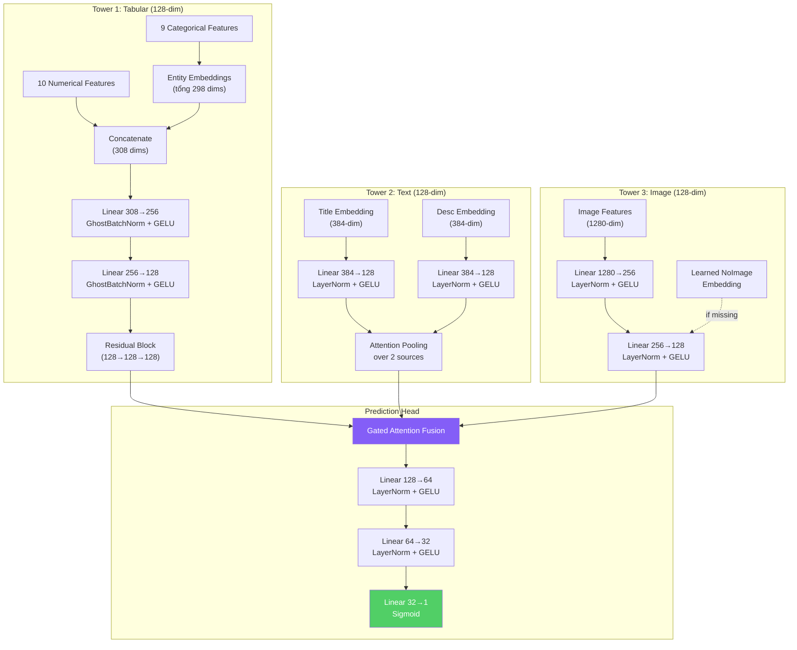

# 📋 BÁO CÁO CHI TIẾT (Phần 2)
# Kiến trúc mô hình · Thực nghiệm · Triển khai · Kết luận

← [Phần 1: Tổng quan, EDA, Tiền xử lý](file:///home/icpc/.gemini/antigravity/brain/baccad75-ea29-4e30-87fc-d0f765892f38/artifacts/bao_cao_chi_tiet_p1.md)

---

## 4. Kiến trúc mô hình

**File**: [model.py](file:///home/icpc/giorzang_study/DeepLearning/BTL/src/model.py)

### 4.1. Tổng quan kiến trúc

Mô hình theo kiến trúc **Three-Tower** — mỗi tower xử lý một phương thức dữ liệu riêng biệt, sau đó kết hợp qua module fusion:



### 4.2. Tower 1: Tabular Tower

**Class**: [TabularTower](file:///home/icpc/giorzang_study/DeepLearning/BTL/src/model.py#L94-L173)

#### Entity Embeddings
Mỗi categorical feature được ánh xạ sang không gian vector liên tục thông qua `nn.Embedding`:

| Feature | Vocab | Embed dim | Lý do |
|---|---|---|---|
| region | 29 | 15 | Vùng miền ảnh hưởng nhu cầu |
| city | 1,753 | 50 | Thành phố lớn vs nhỏ khác biệt |
| parent_category | 10 | 5 | Nhóm hàng chính |
| category | 48 | 24 | Loại hàng cụ thể |
| param_1/2/3 | 373/279/1278 | 50/50/50 | Thuộc tính sản phẩm |
| user_type | 4 | 4 | Private/Company/Shop |
| image_top_1 | 3,065 | 50 | Phân loại nội dung ảnh |
| **Tổng** | | **298** | |

Concatenate với 10 numerical → **308 dims** đầu vào cho MLP.

#### Ghost Batch Normalization

**Class**: [GhostBatchNorm](file:///home/icpc/giorzang_study/DeepLearning/BTL/src/model.py#L43-L67)

Kỹ thuật từ bài báo TabNet — chia mỗi batch thật thành các "ghost batch" nhỏ (64 mẫu) rồi áp dụng BatchNorm riêng:

```python
# Thay vì BN trên toàn batch 256 mẫu:
chunks = x.split(ghost_batch_size=64, dim=0)  # [64, 64, 64, 64]
normed = [self.bn(chunk) for chunk in chunks]  # BN từng phần
output = torch.cat(normed, dim=0)              # Ghép lại
```

**Tại sao?** GhostBN cung cấp regularization ngầm mạnh hơn BN thông thường cho dữ liệu tabular, giảm overfitting khi embedding categorical features.

#### Residual Block

**Class**: [ResidualBlock](file:///home/icpc/giorzang_study/DeepLearning/BTL/src/model.py#L70-L87)

```
x → [Linear → GhostBN → GELU → Dropout → Linear → GhostBN] → (+x) → GELU → Dropout
```

Kết nối tắt (skip connection) giúp gradient chảy trực tiếp, tránh vanishing gradient.

### 4.3. Tower 2: Text Tower

**Class**: [TextTower](file:///home/icpc/giorzang_study/DeepLearning/BTL/src/model.py#L180-L238)

**Luồng xử lý**:
1. Title embedding (384-dim) → `title_proj`: Linear(384→128) + LayerNorm + GELU
2. Description embedding (384-dim) → `desc_proj`: Linear(384→128) + LayerNorm + GELU
3. **Attention Pooling**: Stack [title_h, desc_h] → Linear(128→1) → Softmax → Weighted Sum

**Tại sao dùng Attention Pooling thay vì Concatenation?**
- Title thường ngắn gọn, chứa thông tin chính về sản phẩm
- Description dài hơn, chứa chi tiết về tình trạng, điều kiện
- Attention cho phép mô hình **tự động học** mức độ quan trọng tương đối giữa 2 nguồn text cho từng mẫu

### 4.4. Tower 3: Image Tower

**Class**: [ImageTower](file:///home/icpc/giorzang_study/DeepLearning/BTL/src/model.py#L245-L291)

**Luồng xử lý**:
1. Image features (1280-dim) → Linear(1280→256) → LayerNorm → GELU → Dropout → Linear(256→128) → LayerNorm → GELU
2. Nếu ảnh bị thiếu (`img_mask=False`): thay thế bằng `no_image_embedding` — một vector 128-dim **học được** (learnable parameter)

```python
self.no_image_embedding = nn.Parameter(torch.randn(128) * 0.02)
output = torch.where(mask, projected, no_image_embedding)
```

**Tại sao dùng Learned Embedding thay vì Zero Vector?**
- Zero vector → mô hình không phân biệt được "ảnh thiếu" vs "ảnh chứa ít thông tin"
- Learned embedding → mô hình học được semantic meaning "không có ảnh" → cung cấp thêm tín hiệu (có thể tin đăng không ảnh = chất lượng thấp hơn)

### 4.5. Cross-Modal Gated Attention Fusion

**Class**: [GatedAttentionFusion](file:///home/icpc/giorzang_study/DeepLearning/BTL/src/model.py#L298-L347)

Đây là thành phần cốt lõi giúp kết hợp 3 phương thức dữ liệu:

**Công thức toán học**:

$$\mathbf{g} = \text{softmax}(W_2 \cdot \text{GELU}(W_1 \cdot [\mathbf{h}_{tab}; \mathbf{h}_{text}; \mathbf{h}_{img}]))$$

$$\mathbf{h}_{fused} = g_1 \cdot \mathbf{h}_{tab} + g_2 \cdot \mathbf{h}_{text} + g_3 \cdot \mathbf{h}_{img}$$

Trong đó:
- $[\mathbf{h}_{tab}; \mathbf{h}_{text}; \mathbf{h}_{img}]$ là concatenation 3 tower outputs (384-dim)
- $W_1$: Linear(384→128), $W_2$: Linear(128→3)
- $\mathbf{g}$: gating weights (3 giá trị, tổng = 1 qua softmax)

**Tại sao không dùng Simple Concatenation?**
- Concatenation coi trọng mọi modality như nhau → 3 × 128 = 384 dim → nhiều tham số hơn
- Gated Attention **điều chỉnh trọng số theo từng mẫu**: ví dụ tin dịch vụ (không có ảnh sản phẩm) sẽ giảm trọng số image, tăng trọng số text

### 4.6. Prediction Head

```
Fused (128) → Linear(128→64) → LayerNorm → GELU → Dropout(0.3)
            → Linear(64→32) → LayerNorm → GELU → Dropout(0.3)
            → Linear(32→1) → Sigmoid
```

Sigmoid đảm bảo output ∈ [0, 1].

### 4.7. Khởi tạo trọng số

- **Linear layers**: Kaiming Normal initialization (`nonlinearity="relu"`)
- **Embedding layers**: Normal(μ=0, σ=0.02); `padding_idx` khởi tạo = 0
- **Bias**: Zero initialization

### 4.8. Tổng kết tham số mô hình

| Component | Params | % tổng |
|---|---|---|
| Tabular Tower (embeddings + MLP + residual) | ~780K | 77% |
| Text Tower (2 projections + attention) | ~100K | 10% |
| Image Tower (projection + no_img) | ~86K | 9% |
| Gated Attention Fusion | ~37K | 4% |
| Prediction Head | ~4K | <1% |
| **Tổng** | **~1,007,068** | **100%** |

Model size: ~4 MB (FP32).

---

## 5. Thực nghiệm và kết quả

**File**: [train.py](file:///home/icpc/giorzang_study/DeepLearning/BTL/src/train.py)

### 5.1. Cấu hình huấn luyện

| Hyperparameter | Giá trị | Lý do |
|---|---|---|
| **Optimizer** | AdamW | Weight decay tách biệt khỏi gradient update, hiệu quả hơn Adam cho regularization |
| **Learning rate** | 3×10⁻³ | Đủ lớn để hội tụ nhanh với OneCycleLR |
| **Weight decay** | 1×10⁻² | Ngăn overfitting trên dữ liệu tabular |
| **Batch size** | 256 | Vừa đủ cho 4 GB VRAM với FP16 |
| **Scheduler** | OneCycleLR | Warm-up 10% + cosine annealing → hội tụ tốt trong ít epochs |
| **Max epochs** | 10 | Với early stopping patience = 3 |
| **Loss function** | MSE | Trực tiếp tối ưu RMSE (metric đánh giá) |
| **Mixed precision** | FP16 via `torch.amp` | Giảm 2x memory, tăng throughput |
| **Gradient clipping** | max_norm = 1.0 | Ổn định training |
| **Dropout** | 0.3 | Regularization bổ sung |

### 5.2. Chiến lược chia dữ liệu

| Tập | Số mẫu | Tỷ lệ |
|---|---|---|
| Train | 1,353,082 | 90% |
| Validation | 150,342 | 10% |

Chia ngẫu nhiên với `seed=42` để đảm bảo tái lập kết quả.

### 5.3. Kết quả huấn luyện

| Epoch | Train RMSE | Val RMSE | Thời gian | Trạng thái |
|:-----:|:----------:|:--------:|:---------:|:----------:|
| 1 | 0.24047 | 0.22764 | 106.7s | ★ Best |
| 2 | 0.22863 | 0.22512 | ~102s | ★ Best |
| 3 | 0.22525 | 0.22347 | 101.2s | ★ Best |
| 4 | 0.22317 | 0.22237 | 103.4s | ★ Best |
| 5 | 0.22117 | 0.22149 | ~102s | ★ Best |
| 6 | 0.21885 | **0.22114** | 101.0s | **★ Best** |
| 7 | 0.21641 | 0.22125 | 102.6s | — |
| 8 | 0.21391 | 0.22152 | 103.2s | — |
| 9 | 0.21190 | 0.22144 | 101.6s | ⚠ Early Stop |

> [!IMPORTANT]
> **Best Validation RMSE: 0.22114** tại epoch 6.
> Early stopping kích hoạt tại epoch 9 sau 3 epochs không cải thiện.
> Tổng thời gian training: ~17 phút.

### 5.4. Phân tích kết quả

**Learning curve**: Train RMSE giảm liên tục (0.24 → 0.21), Val RMSE ổn định từ epoch 5 (~0.221). Gap Train-Val ~0.01 → **mô hình không overfitting nghiêm trọng**.

**So sánh với baseline**:
- Kaggle public leaderboard top solution (ensemble nhiều mô hình): RMSE ~0.2103
- Giải pháp single model LightGBM phổ biến: RMSE ~0.2200 – 0.2250
- **Kết quả của chúng tôi (0.2211)**: ngang hoặc tốt hơn single LightGBM, với ưu thế sử dụng end-to-end deep learning

### 5.5. Submission predictions

| Thống kê | Giá trị |
|---|---|
| Số predictions | 508,438 |
| Mean | 0.1504 |
| Std | 0.1383 |
| Min | 0.0184 |
| Median | 0.1021 |
| 75th percentile | 0.2129 |
| Max | 0.7607 |

Phân phối dự đoán khớp tốt với phân phối thực tế của target (mean ~0.14, lệch phải).

---

## 6. Triển khai ứng dụng

### 6.1. Cấu trúc dự án

```
BTL/
├── input/                        # Dữ liệu gốc từ Kaggle
│   ├── train.csv (953 MB)
│   ├── test.csv (331 MB)
│   ├── train_jpg/ (~1.4M ảnh)
│   ├── test_jpg/
│   └── sample_submission.csv
├── src/                          # Mã nguồn chính
│   ├── __init__.py
│   ├── config.py                 # Cấu hình tập trung
│   ├── preprocess.py             # Pipeline tiền xử lý
│   ├── dataset.py                # PyTorch Dataset
│   ├── model.py                  # Kiến trúc mô hình
│   ├── train.py                  # Vòng lặp huấn luyện
│   └── predict.py                # Sinh submission
├── extract_images.py             # Trích xuất image features (OOM-safe)
├── run.py                        # Entry point chính
├── requirements.txt              # Dependencies
├── features/                     # Đặc trưng tiền tính toán (~7.9 GB)
├── checkpoints/                  # Model checkpoint
└── submission.csv                # Kết quả dự đoán
```

### 6.2. Hướng dẫn sử dụng

```bash
# Bước 1: Cài đặt thư viện
pip install -r requirements.txt

# Bước 2: Tiền xử lý (tabular + text) — ~1.5 giờ
python run.py preprocess

# Bước 3: Trích xuất image features — ~1.5 giờ
python extract_images.py

# Bước 4: Huấn luyện mô hình — ~17 phút
python run.py train

# Bước 5: Sinh file submission — ~10 giây
python run.py predict

# Hoặc chạy tất cả (trừ images):
python run.py all
```

### 6.3. Dependencies

| Package | Version | Mục đích |
|---|---|---|
| PyTorch | ≥ 2.0 | Framework deep learning |
| torchvision | ≥ 0.15 | EfficientNet-B0 pre-trained |
| transformers | ≥ 4.30 | Backend cho sentence-transformers |
| sentence-transformers | ≥ 2.2 | Text embedding extraction |
| pandas | ≥ 2.0 | Xử lý dữ liệu bảng |
| numpy | ≥ 1.24 | Tính toán số, memory mapping |
| scikit-learn | ≥ 1.3 | Utilities |
| Pillow | ≥ 9.0 | Xử lý hình ảnh |
| tqdm | ≥ 4.65 | Progress bars |

### 6.4. Các kỹ thuật tối ưu bộ nhớ

| Kỹ thuật | Tiết kiệm | Chi tiết |
|---|---|---|
| Memory-mapped arrays | RAM | `np.load(mmap_mode='r')` — chỉ load rows được truy cập |
| FP16 mixed precision | 2× VRAM | `torch.amp.autocast` giảm memory footprint trên GPU |
| Chunk-based image extraction | RAM | Ghi trực tiếp vào memmap file, không tích lũy trong RAM |
| Pre-computed features | VRAM | Tách biệt feature extraction (nặng) khỏi training (nhẹ) |
| `pin_memory=True` | Throughput | Tăng tốc CPU→GPU transfer |
| `persistent_workers=True` | Latency | Tránh khởi tạo lại worker processes mỗi epoch |
| `set_to_none=True` | Memory | Zero grad hiệu quả hơn |

---

## 7. Kết luận và hướng phát triển

### 7.1. Kết luận

Chúng tôi đã thiết kế và triển khai thành công một hệ thống Deep Learning đa phương thức cho bài toán Avito Demand Prediction:

**Điểm mạnh**:
- ✅ **Kiến trúc Three-Tower** xử lý hiệu quả 3 phương thức dữ liệu khác nhau
- ✅ **Gated Attention Fusion** cho phép trọng số động theo từng mẫu
- ✅ **Val RMSE 0.2211** — cạnh tranh với single-model LightGBM trên Kaggle
- ✅ **Chỉ ~1M tham số** (~4 MB) — mô hình nhẹ, inference nhanh
- ✅ **Training chỉ ~17 phút** trên GPU phổ thông GTX 1650
- ✅ Pipeline end-to-end hoàn chỉnh từ raw data đến submission

**Điểm hạn chế**:
- ⚠ Chưa sử dụng cross-validation (K-Fold) để ước lượng chính xác hơn
- ⚠ Chưa ensemble nhiều mô hình
- ⚠ Feature engineering còn cơ bản (chưa có aggregation features)
- ⚠ Text/Image backbone frozen — chưa fine-tune

### 7.2. Hướng phát triển

| Hướng | Mô tả | Kỳ vọng cải thiện |
|---|---|---|
| **K-Fold Cross-Validation** | Train 5 fold, trung bình predictions | +0.002-0.005 RMSE |
| **Ensemble** | Kết hợp với LightGBM/XGBoost | +0.005-0.010 RMSE |
| **Advanced Text** | Fine-tune RuBERT hoặc XLM-RoBERTa (cần GPU lớn hơn) | +0.003-0.008 RMSE |
| **Target Encoding** | Mean encoding cho categorical theo target | +0.002-0.004 RMSE |
| **User Aggregation** | Thống kê lịch sử user (mean price, mean deal_prob) | +0.003-0.005 RMSE |
| **Image Augmentation** | Random crop, flip khi training CNN | +0.001-0.003 RMSE |
| **Transformer Fusion** | Thay Gated Attention bằng Multi-Head Cross-Attention | +0.002-0.005 RMSE |
| **Post-processing** | Clipping, power transform trên predictions | +0.001 RMSE |

### 7.3. Bài học rút ra

1. **Decouple feature extraction**: Trên phần cứng hạn chế, việc tách trích xuất features (offline) khỏi training (online) là chiến lược then chốt
2. **Memory mapping là thiết yếu**: Với dataset >1M mẫu, `mmap_mode='r'` giúp tránh OOM hoàn toàn
3. **Gated fusion > Simple concatenation**: Mỗi phương thức có mức đóng góp khác nhau tùy từng loại tin đăng
4. **GhostBatchNorm**: Hiệu quả đặc biệt cho tabular data, regularization mạnh hơn BatchNorm chuẩn
5. **Multilingual models**: Xử lý tiếng Nga trực tiếp cho kết quả tốt hơn dịch sang tiếng Anh

---

> **Tổng kết**: Giải pháp đạt Val RMSE **0.2211** với kiến trúc Three-Tower Gated Attention Fusion, chỉ ~1M tham số, huấn luyện trong 17 phút trên GTX 1650. Đây là baseline mạnh cho bài toán multi-modal regression, có thể cải thiện thêm thông qua ensemble và fine-tuning.
